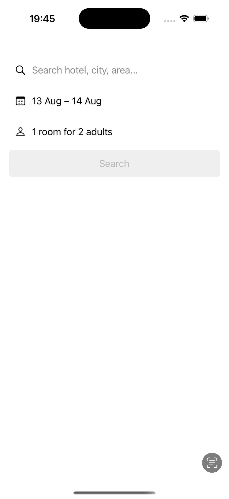
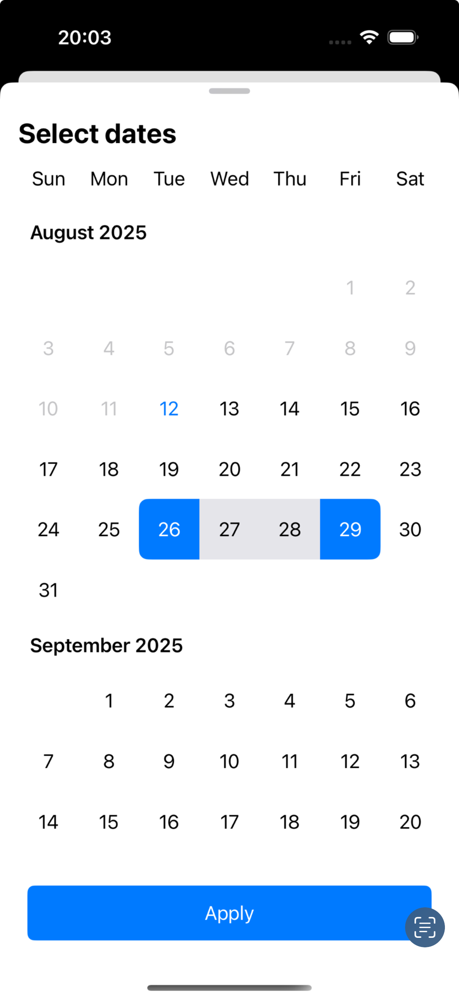
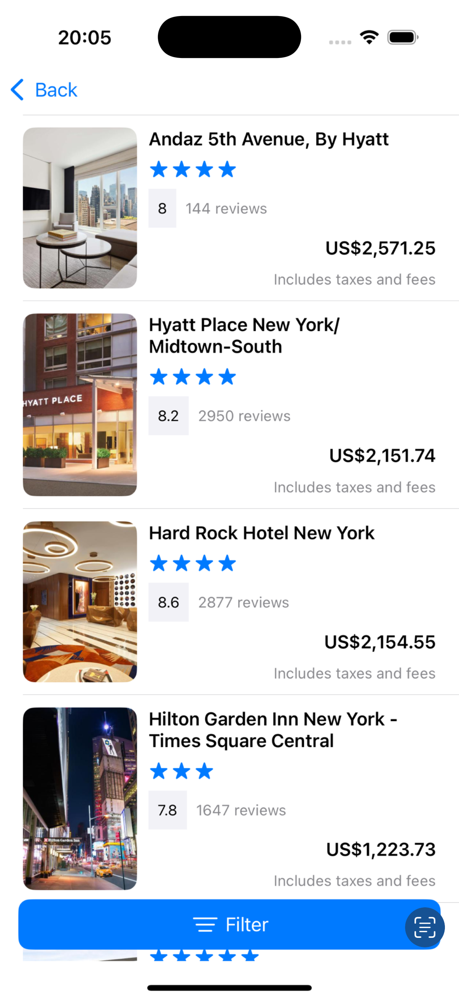
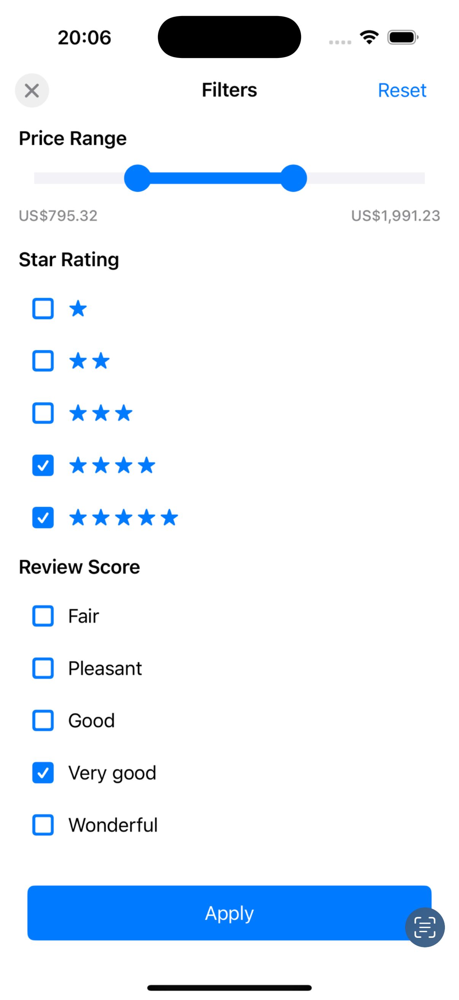

# HotelsDemo

*A clean-architecture iOS app showcasing hotel search, filtering, and booking with modern Swift.*

> [!NOTE]
> This project was created as a personal learning exercise to practice building applications using the VIP (View–Interactor–Presenter) architecture. The focus is on clean separation of concerns, modularity, and testability rather than on complete product features or UI polish. It is intended for demonstration in a portfolio to showcase architectural decision-making, code organization, and implementation skills.

## Screenshots

| Screen 1 | Screen 2 |
|----------|----------|
||
||

| Screen 3 | Screen 4 |
|----------|----------|
||
||

---

## Overview

HotelsDemo demonstrates how to build a modern iOS application using **Clean Swift (VIP)** architecture.  
It includes a fully functional hotels search, filtering, and booking flow — all backed by a clean, testable design.

---

## Architecture

The project follows the **Clean Swift (VIP)** pattern, ensuring separation of concerns and testability.

**Core layers:**
- **Features** – Main functionality modules organized by domain (e.g., Hotels Search, Booking)
- **Shared** – Common utilities and base components
- **Shared UI** – Reusable UI components
- **Helpers** – Utility functions and extensions


---

## Technical Stack

- **UIKit**
- **XCTest** for unit testing
- **SwiftLint** for code style enforcement
- **GitHub Actions** for CI/CD

---

## Requirements

- iOS **18.0+**
- Xcode **16.0+**
- Swift **6.0+**

---

## Getting Started

1. **Clone the repository**

```bash
git clone https://github.com/denyskt-hub/HotelsDemo.git
```

2. **Open the project in Xcode**

```bash
open HotelsDemo.xcodeproj
```

3. **Select the `HotelsDemo` scheme**

4. **Build & Run** on your desired simulator or device

---

## Features

- Hotel Search with filters (price, rating, review score)
- Search Criteria Management
- Hotel Details View
- Booking Functionality
- Reusable UI Components
- Comprehensive Unit Tests
- Modern Swift Features (Result builders, Codable, generics)

---

## Testing

The project includes comprehensive unit tests covering:
- Business logic
- Data mapping
- User interactions
- Edge cases

Run tests:
- From Xcode’s Test Navigator
- Or via command line:

```bash
xcodebuild test \
  -scheme HotelsDemo \
  -destination 'platform=iOS Simulator,name=iPhone 15'
```

---

## Continuous Integration

GitHub Actions handles:
- Automated builds
- Unit test execution
- SwiftLint style validation

---

## Roadmap

- [ ] Sort hotels on search screen
- [ ] Add cache EvictionPolicy
- [ ] Add localization
- [ ] Display filters metadata
- [ ] Hotels search criteria editing on search screen

---

## License

This project is licensed under the MIT License — see the LICENSE file for details.
